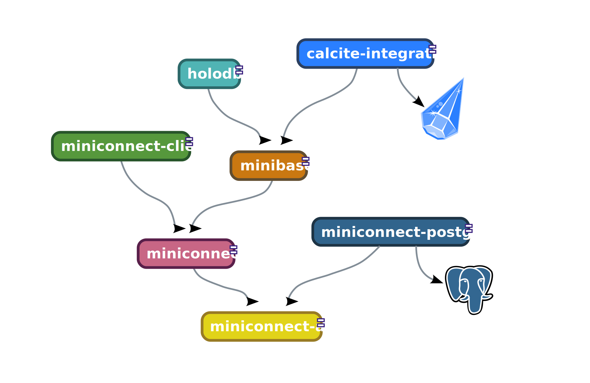

# Overview of the repositories

These repositories contain the source code of the application components:

[See also the version compatibility table.](VERSIONS.md)

All inter-repository dependencies between the subprojects are top-down in the figure.

## Focal repositories

### [miniconnect-api](https://github.com/miniconnect/miniconnect-api)

Minimalistic database API, an alternative to JDBC.

### [miniconnect](https://github.com/miniconnect/miniconnect)

Various equipment for MiniConnect, including JDBC adapter, networking, implementation helpers, and more.

### [miniconnect-client](https://github.com/miniconnect/miniconnect-client)

Command line SQL REPL and networking client for the MiniConnect API.

### [minibase](https://github.com/miniconnect/minibase)

Java framework for building relational database engines exposed via the MiniConnect API.

### [holodb](https://github.com/miniconnect/holodb)

Relational database simulator based on MiniBase, generating demo data on-the-fly, based on declarative configuration.

### [phantomapi](https://github.com/miniconnect/phantomapi)

A reasoned, coherent API mocker driven by OpenAPI descriptions.

## Helper repositories

### [general-docs](https://github.com/miniconnect/general-docs)

The main docs repository, providing an umbrella view of the MiniConnect infrastructure.

### [miniconnect.github.io](https://github.com/miniconnect/miniconnect.github.io)

The MiniConnect GitHub site.

### [.github](https://github.com/miniconnect/.github)

GitHub integration files.

## Other repositories

### [calcite-integration](https://github.com/miniconnect/calcite-integration)

An experimental repository for incubating dedicated support for Apache Calcite.

### [miniconnect-postgres](https://github.com/miniconnect/miniconnect-postgres)

An experimental repository for incubating dedicated support for the Postgres wire protocol.

### [innotdk2025](https://github.com/miniconnect/innotdk2025)

Materials presented at the final of the 2025 InnOtdk innovation competition.
